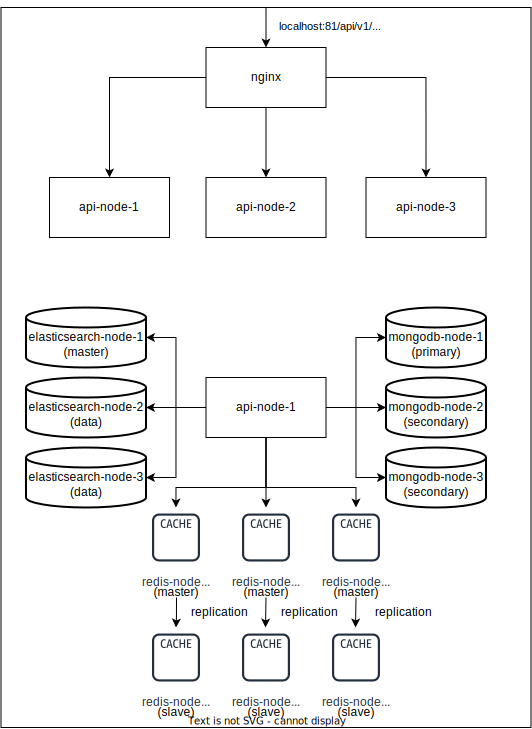

# Проект по разработке распределенных приложений - Продажа ЖД билетов

## Используемые технологии:
- Java в качестве основного языка программирования
- Spring Boot для rest-api приложения
- lombok для сокращения кода в классах и расширения функциональности языка Java
- mapstruct помогает маппить объекты одних сущностей в объекты других сущностей
- junit для тестирования
- javascript для скриптов в mongodb
- mongodb как основное хранилище данных
- elasticsearch для полнотекстового поиска
- redis в качестве кэширования и блокирования
- docker для виртуализации
- docker-compose для оркестрации и запуска кластера
- nginx в качестве балансировщика нагрузки
## Основные сущности:
- Остановочный пункт (Station) - справочник станций, которые могут быть пунктом отправления или назначения в билете (Москва, Бологое, Санкт-Петербург)
- Маршрут (Route) - множество станций, на которых останавливается поезд (маршрут #251: Москва, Тверь, Вышний Волочек, Бологое, Санкт-Петербург)
- Поезд (Train) - поезд, назначенный на указанные маршрут на конкретную дату (рейс поезда следует, назначенный на 25.09.2017  следует по маршруту #251)
- Билет (TicketPlace) - место в поезде, свободное или купленное.

## Задача:
Требуется реализовать прототип распределенной системы для продажи железнодорожных билетов для одной из наиболее развитых железнодорожных сетей мира. Система должна обеспечивать устойчивость к обрывам связи при стабильной гарантированной производительности.
Для хранения данных предлагается использовать кластер MongoDB с шардингом и репликацией.
Для поиска поездов и доступных билетов - ElasticSearch
Для кэширования справочников (станций) - кэш Redis
Для блокирования места при бронировании и до получения оплаты - механизм блокировок в Redis

## Сценарии:
*  Инициализация поездов 
   1. Заполнение данными Station, Route
   2. Заполнение данными Train и TicketPlace (порядка миллионов документов в TicketPlace)
*  Поиск свободных мест и покупка билета
   1. Пользователь вводит станции отправления и назначения, дату отправления
   2. Система определяет подходящие по станциям маршруты и ищет поезда, следующие по этим маршрутам, отображая только те, на которых есть свободные места
   3. Пользователь выбирает поезд, система отображает свободные места
   4. Пользователь выбирает свободное место и нажимает "Купить билет"
   5. Система блокирует указанное место до символической "велиоплаты"
   6. Пользователь оплачивает билет
   7. Система помечает билет как купленные и снимает блокировку

## Архитектура кластера:
